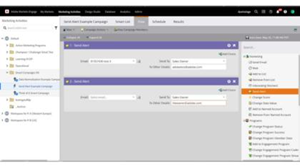

# [!DNL Marketo Engage] Tutorial

Sfoglia la libreria dei tutorial e sfrutta al massimo [!DNL Marketo Engage]. Questi tutorial possono essere utili per integrare la [[!DNL Marketo] documentazione del prodotto](https://experienceleague.adobe.com/docs/marketo/using/home.html?lang=it){target="_blank"} e aiutarti a comprendere meglio le funzioni di automazione marketing.

<!-- 

 -->

## Novità {#whats-new}

* [Best practice per implementare la chat in tempo reale](https://experienceleague.adobe.com/en/docs/marketo-learn/tutorials/dynamic-chat/live-chat-best-practices.md)
  _Scopri le best practice da seguire per implementare la funzionalità di chat in tempo reale in Dynamic Chat._

* [Panoramica dei webinar interattivi](https://experienceleague.adobe.com/en/docs/marketo-learn/tutorials/events/interactive-webinars-overview)
  _Scopri tutto sui webinar interattivi, la piattaforma incorporata all&#39;interno di Marketo Engage._

* [Migrazione ad Adobe Identity Management](https://experienceleague.adobe.com/en/docs/marketo-learn/tutorials/fundamentals/migrating-to-adobe-identity-management)
  _Scopri come navigare nella migrazione di Adobe Identity Management in modo da poter iniziare a gestire Adobe Marketo Engage insieme ad altri account e prodotti Adobe per i tuoi utenti da una posizione centrale._

## Video più popolari {#most-popular-videos}

<table>
<tr>
<td>

<a href="https://experienceleague.adobe.com/it/docs/marketo-learn/tutorials/programs-and-campaigns/smart-campaigns-101"><strong>Introduzione alle campagne intelligenti</strong></a>

</td>
<td>

<a href="https://experienceleague.adobe.com/en/docs/marketo-learn/tutorials/dynamic-chat/conversational-forms"><strong>Forms per conversazioni</strong></a>

</td>
<td>

<a href="https://experienceleague.adobe.com/it/docs/marketo-learn/tutorials/fundamentals/programs-and-campaigns"><strong>Informazioni sui programmi e le campagne di Marketo</strong></a>

</td>
</tr>
</table>
