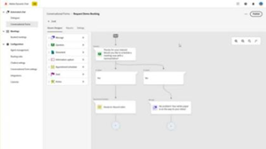

# Tutorial su [!DNL Marketo Engage]

Sfoglia la libreria dei tutorial e ottieni il massimo da [!DNL Marketo Engage]. Questi tutorial possono essere utili per integrare la [[!DNL Marketo] documentazione del prodotto](https://experienceleague.adobe.com/docs/marketo/using/home.html?lang=it){target="_blank"} al fine di comprendere meglio le funzioni di automazione del marketing.

<!-- 

 
-->

## Novità {#whats-new}

* [Importazione modello](/help/main/shorts/template-import.md)
  _Scopri come importare i modelli e-mail esistenti dall’editor classico in E-mail Designer, mantenendo le progettazioni e accelerando la creazione dei modelli.._

* [Assistente AI per E-mail Designer](/help/main/shorts/ai-assistant-email-designer.md)
  _Utilizza l&#39;Assistente AI in Marketo Engage Email Designer per creare e-mail contemporanee, performanti e intuitive._

* [Contenuto condizionale](/help/main/shorts/conditional-content.md)
  _Scopri come controllare dinamicamente il contenuto visualizzato dal pubblico._

## Video più popolari {#most-popular-videos}

<table>
<tr>
<td>

<a href="https://experienceleague.adobe.com/it/docs/marketo-learn/tutorials/programs-and-campaigns/smart-campaigns-101"><strong>Campagne smart 101</strong></a>

</td>
<td>

<a href="https://experienceleague.adobe.com/it/docs/marketo-learn/tutorials/dynamic-chat/conversational-forms"><strong>Moduli conversazionali</strong></a>

</td>
<td>

<a href="https://experienceleague.adobe.com/it/docs/marketo-learn/tutorials/fundamentals/programs-and-campaigns"><strong>Informazioni sui programmi e sulle campagne di Marketo</strong></a>

</td>
</tr>
</table>
