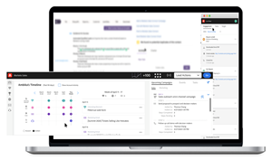

# Tutorial sulle azioni di Sales Insight

Utilizza [!UICONTROL Sales Insight Actions] per accelerare le attività di ricerca di potenziali clienti con strumenti di marketing e coinvolgimento in un unico flusso di lavoro.

>[!NOTE]
>
>Marketo Sales Insight Actions è un&#39;applicazione basata su Web che si integra esclusivamente con Salesforce CRM tramite il [pacchetto Marketo Sales Insight](https://experienceleague.adobe.com/it/docs/marketo/using/product-docs/marketo-sales-insight/msi-for-salesforce/installation/install-marketo-sales-insight-package-in-salesforce-appexchange){target="_blank"}. A volte viene chiamato &quot;Vendite Marketo&quot; o semplicemente &quot;Azioni&quot;.

## Tutorial in primo piano {#featured-tutorials}

<table style="table-layout:fixed">
<tr>
<td>

<a href="/help/main/sales-insight-actions/sales-insight-actions-overview.md"><strong>Panoramica delle azioni di Sales Insight</strong></a>

</td>
<td>

<a href="/help/main/sales-insight-actions/accessing-your-sales-insight-actions-instance.md"><strong>Accesso all'istanza delle azioni Insight per le vendite</strong></a>

</td>
<td>

<a href="/help/main/sales-insight-actions/configure-sales-activity-logging-to-salesforce.md"><strong>Configura registrazione attività di vendita in [!DNL Salesforce]</strong></a>

</td>
</tr>
</table>

## Articoli in primo piano {#featured-articles}

<table style="table-layout:fixed">
<tr>
<td>

<a href="https://experienceleague.adobe.com/docs/marketo/using/product-docs/marketo-sales-insight/actions/sales-insight-actions-feature-overview.html?lang=it"><strong>Panoramica delle funzioni Azioni di Insight per le vendite</strong></a>

<em>Accelera le attività di ricerca di potenziali clienti con strumenti di intelligenza e coinvolgimento basati sul marketing.</em>

</td>
<td>

Guida all'onboarding di <a href="https://experienceleague.adobe.com/docs/marketo/using/product-docs/marketo-sales-insight/actions/getting-started/sales-insight-actions-user-onboarding-checklist.html?lang=it"><strong>[!DNL Sales Insight Actions] utenti</strong></a>

<em>Passaggi che i nuovi utenti dovranno seguire per iniziare.</em>

</td>
<td>

<a href="https://experienceleague.adobe.com/docs/marketo/using/product-docs/marketo-sales-insight/actions/admin/actions-data-sync-faq.html?lang=it"><strong>Domande frequenti sulla sincronizzazione dei dati delle azioni</strong></a>

<em>Domande frequenti sul funzionamento della sincronizzazione dell'unificazione dei dati.</em>

</td>
</tr>
</table>
