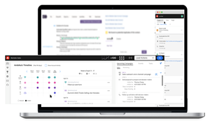

# Tutorials azioni approfondimento vendite

Utilizzare [!UICONTROL Azioni approfondimento vendite] accelerare le attività di ricerca di potenziali clienti con strumenti di marketing e coinvolgimento riuniti in un unico flusso di lavoro.

>[!AVAILABILITY]
>
>Questa funzione è attualmente in fase di rollout. Contatta il tuo Customer Success Manager o invia un messaggio e-mail `sales-insights(at)adobe(dot)com` per richiedere l&#39;accesso.

## Tutorials in primo piano {#featured-tutorials}

<table style="table-layout:fixed">
<tr>
<td>

<a href="/help/sales-insight-actions/sales-insight-actions-overview.md"><strong>Panoramica delle azioni di approfondimento sulle vendite</strong></a>

</td>
<td>

<a href="/help/sales-insight-actions/accessing-your-sales-insight-actions-instance.md"><strong>Accesso all’istanza delle azioni Sales Insight</strong></a>

</td>
<td>

<a href="/help/sales-insight-actions/configure-sales-activity-logging-to-salesforce.md"><strong>Configura registrazione attività di vendita in [!DNL Salesforce]</strong></a>

</td>
</tr>
</table>

## Articoli in primo piano {#featured-articles}

<table style="table-layout:fixed">
<tr>
<td>

<a href="https://experienceleague.adobe.com/docs/marketo/using/product-docs/marketo-sales-insight/actions/sales-insight-actions-feature-overview.html"><strong>Panoramica sulla funzione Azioni approfondimenti vendite</strong></a>

<em>Accelera le attività di ricerca di potenziali clienti con strumenti di intelligenza e coinvolgimento basati sul marketing.</em>

</td>
<td>

<a href="https://experienceleague.adobe.com/docs/marketo/using/product-docs/marketo-sales-insight/actions/getting-started/sales-insight-actions-user-onboarding-checklist.html"><strong>[!DNL Sales Insight Actions] Guida all’onboarding degli utenti</strong></a>

<em>Passaggi che i nuovi utenti dovranno seguire per iniziare.</em>

</td>
<td>

<a href="https://experienceleague.adobe.com/docs/marketo/using/product-docs/marketo-sales-insight/actions/admin/actions-data-sync-faq.html"><strong>Domande frequenti sulla sincronizzazione dei dati delle azioni</strong></a>

<em>Domande frequenti sul funzionamento della sincronizzazione dell'unificazione dei dati.</em>

</td>
</tr>
</table>

## Supporto personalizzato {#personalized-support}

Per ricevere supporto personalizzato per questa funzione, [pianificare una chiamata](https://outlook.office365.com/owa/calendar/AdobeInc1@adobe.onmicrosoft.com/bookings/) con il team di prodotto.

## Segnala bug/feedback {#report-a-bug-feedback}

Se riscontri un bug o hai un feedback generale su questa funzione, inviaci un&#39;e-mail all&#39;indirizzo `sales-insights(at)adobe(dot)com`.
